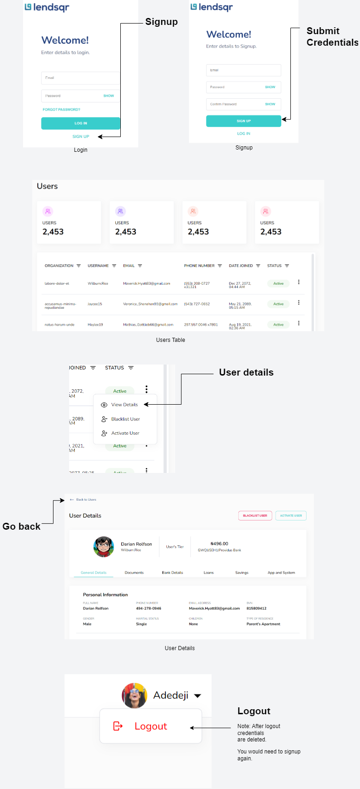

# [Lendsqr Frontend Assessment Test](https://docs.google.com/document/d/e/2PACX-1vRavO_8CGUr5rk-swNnsA4PTN-GAEXTtUoMgxJ_50eH_fG5_FId7ik--MK6LBIgoHlLO3aq2mdN31Na/pub)

## A React app bundled with [Vite](https://vitejs.dev/) implementing this [design](https://www.figma.com/file/ZKILoCoIoy1IESdBpq3GNC/FrontendTesting?node-id=5530%3A0)

This project is an example built implementing this [design](https://www.figma.com/file/ZKILoCoIoy1IESdBpq3GNC/FrontendTesting?node-id=5530%3A0) for an assessment [test](https://docs.google.com/document/d/e/2PACX-1vRavO_8CGUr5rk-swNnsA4PTN-GAEXTtUoMgxJ_50eH_fG5_FId7ik--MK6LBIgoHlLO3aq2mdN31Na/pub)

---

## How to install this project

1. Clone this project
2. Make sure at least [Node LTS](https://nodejs.org/en/) is installed
3. Inside the project in the terminal run `npm install && npm run dev`
4. Navigate to `http://localhost:5173` or the URL in the terminal

---

## To see test results

1. In the terminal run `npm run test`
2. Navigate to `http://localhost:51204/__vitest__` or the URL in the terminal
